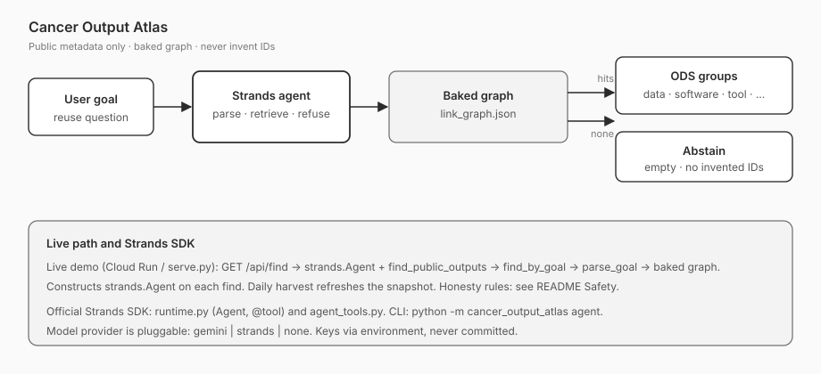
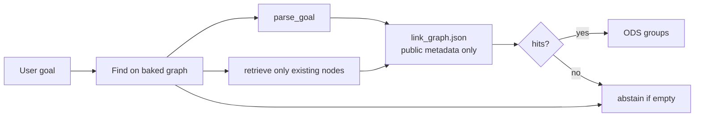
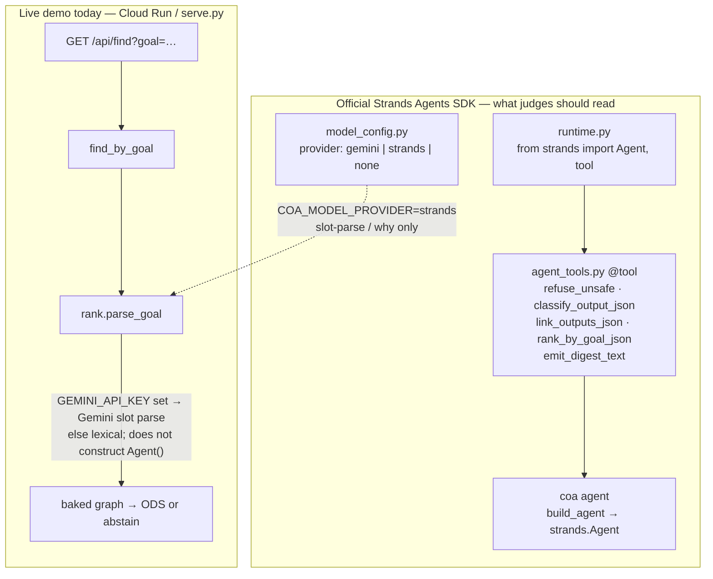

# Cancer Output Atlas

**Apache-2.0** · [Agents for Humans](https://agentsforhumans.devpost.com/) · Professional Agents

An agent that turns a researcher's reuse goal into a short list of **already-public cancer research outputs** they can actually open — datasets, software, workflows, models, trial records, and biospecimen pointers — grouped by [NCI ODS](https://datascience.cancer.gov/) output type.

It does **not** invent GEO, NCT, DOI, or other accessions. If the baked graph has no match, it **abstains**.

**Live demo:** https://cancer-output-atlas-ulao4pneza-uc.a.run.app

---

## What it does

Cancer researchers already know the portals (GEO, ClinicalTrials.gov, cBioPortal, Dockstore, GDC, …). What they do not have is a single, honest answer to *“what public outputs can I reuse for this goal?”* Search engines return papers. Portals return catalogs. Neither one says “nothing here” when the graph is empty.

Cancer Output Atlas:

1. Takes a free-text goal (English or Chinese).
2. Parses it into topic / type slots (`parse_goal`).
3. Retrieves **only** nodes that already exist on a baked public-metadata graph.
4. Groups hits by ODS type (data, software, tool, method, model, trial result, biospecimen).
5. **Abstains** when nothing relevant is on the graph — it never fabricates an ID to fill the page.

Find does **not** re-ingest. The graph is built offline from allow-listed public metadata APIs (or fixtures) and then frozen. Controlled resources (dbGaP, HTAN sequencing, GDC BAM, COSMIC tables) appear only as apply-yourself pointers.

## Who it is for

Cancer researchers and computational biologists who need **reusable public outputs** — a GEO series they can cite, a trial record they can read, a Nextflow workflow they can run, a portal they can open — not another literature chatbot.

Typical goals the live demo is built for:

- virtual cell / Arc Virtual Cell Atlas resources
- lung / NSCLC public data and trials
- a nonsense or empty goal, which must abstain

---

## Architecture

User goal → agent tools → baked graph → ODS groups or abstain. No live ingest on find. No claim graph.





The find path ranks a **baked** `out/link_graph.json`. It does not call GEO or any other API at query time, and it does not download omics.

A second diagram of how the official SDK is wired:



---

## How judges see Strands

Judges score **thorough use of the official Strands Agents SDK**. This repo uses the real package (`strands-agents` in `pyproject.toml`), not a stub.

| File | What it is |
|------|------------|
| [`src/cancer_output_atlas/runtime.py`](src/cancer_output_atlas/runtime.py) | **Only** module that imports Strands. `from strands import Agent, tool`. `build_agent()` constructs an official `strands.Agent`. If the import fails, `@tool` degrades to a passthrough so offline tests still run — that fallback is **not** a Strands API. |
| [`src/cancer_output_atlas/agent_tools.py`](src/cancer_output_atlas/agent_tools.py) | Real `@tool` wrappers: refuse unsafe fetches, classify one output, link outputs, rank by goal, emit a what/why/ids digest. Tests assert these are `strands.tools.decorator.DecoratedFunctionTool`. |
| `python -m cancer_output_atlas agent` | Constructs `strands.Agent(tools=…, system_prompt=…)` and runs the official loop. `--no-llm` runs the same tools as plain functions. |
| [`src/cancer_output_atlas/model_config.py`](src/cancer_output_atlas/model_config.py) | Pluggable text provider: `gemini` \| `strands` \| `none`. Keys come from the environment and are never logged or committed. |

**Current truth about the live demo.** `serve.py` ranks the baked graph through `find_by_goal`. Goal parsing is `rank.parse_goal`: Gemini slot-parse when `GEMINI_API_KEY` is present, otherwise the lexical parser. The Cloud Run container does **not** construct `strands.Agent` on each find. Setting `COA_MODEL_PROVIDER=strands` routes slot-parse / retrieved-only “why” text through official Strands (`generate_text` in `model_config.py`). There is **no** Amazon Bedrock AgentCore deploy in this submission.

Wiring Strands as the live `/api/find` path is a later pass. Do not treat the live URL as proof that `Agent()` is already on the request path.

---

## Clone and run

Needs Python 3.10+. No API key is required for the offline path.

```bash
git clone https://github.com/<you>/cancer-output-atlas.git
cd cancer-output-atlas
python3 -m venv .venv
source .venv/bin/activate   # Windows: .venv\Scripts\activate
pip install -e ".[dev]"
cp .env.example .env        # optional; do not put real keys in git
```

### Offline (fixtures, no network, no LLM) — what CI uses

```bash
COA_OFFLINE=1 python -m cancer_output_atlas run --offline --out out
COA_OFFLINE=1 pytest
python -m cancer_output_atlas info    # strands install status
```

Then find or serve against the graph you just wrote:

```bash
python -m cancer_output_atlas find \
  --goal "virtual cell related dataset" \
  --graph out/link_graph.json --out out

python -m cancer_output_atlas serve --out out --port 8080
# open http://127.0.0.1:8080/
```

Empty-goal check (must abstain, must not invent IDs):

```bash
python -m cancer_output_atlas find \
  --goal "qzwxecrvtbynulmpkj424242" \
  --graph out/link_graph.json --out out
```

### Live metadata ingest (still no omics download, still no invented IDs)

```bash
python -m cancer_output_atlas run --out out --check-links
```

Failed fetches are **skipped**, not filled in from memory.

### Official Strands Agent loop

Needs a model provider if you omit `--no-llm`. Default unattended `run` never constructs `Agent()`.

```bash
python -m cancer_output_atlas agent --offline --no-llm --out out
# python -m cancer_output_atlas agent --model <official-strands-model-id>
```

### Model provider (optional)

`COA_MODEL_PROVIDER` is `gemini` | `strands` | `none`.

- Default: `gemini` if `GEMINI_API_KEY` or `GOOGLE_API_KEY` is set, else `none` (lexical parse + BM25).
- `COA_OFFLINE=1` forces `none`.
- `COA_MODEL_PROVIDER=strands` uses official Strands for slot-parse / why text.
- Keys are environment-only. They are never committed. See `.env.example`.

Artifacts in `out/` after `run`:

- `classification_table.json` / `.csv` — kind, labels, profile_fit, observed IDs
- `link_graph.json` — reuse graph (`cancer_output_atlas.v1`)
- `digest.md` — what / why / ids
- `ranked.json` — rank-by-goal
- `dropped_links.jsonl` — landings removed by `check-links`

---

## Safety

This product is public research-output metadata. It is **not** clinical advice and is not endorsed by NCBI, Figshare, ClinicalTrials.gov, cBioPortal, GDC, TCIA, Dockstore, or Arc Institute.

- **Public metadata only.** NCBI E-utilities, Figshare, ClinicalTrials.gov API v2, cBioPortal `/api/studies`, Dockstore TRS, GDC `/projects`, TCIA collection *names*, nf-core `pipelines.json`, Europe PMC REST, GitHub search. No scraping of paywalled pages.
- **Never invent** GEO, SRA, DOI, or NCT identifiers. If it was not on the landing or in the API payload, it is not in the atlas.
- **Skip on fetch failure.** No guessed records.
- **No PHI. No dbGaP file download.** `phs######` / “controlled access” are refused as fetch targets. HTAN/dbGaP is an apply-yourself pointer.
- **Do not download** `.h5ad` / BAM / FASTQ / MTX / VCF / DICOM or other omics payloads. Figshare file *names* may be listed from metadata.
- **`gs://` is a pointer.** Object-store URIs are never listed as downloads.
- **GDC `/data`, `/slicing`, BAM** are refused. TCIA DICOM is refused. cBioPortal mutation/CNA matrix endpoints are refused. COSMIC tables are not scraped.
- **One-click only** for already-public metadata hosts listed in `safety.py`.
- **Link liveness** uses HTTP HEAD (small GET fallback). Bodies and payloads are never downloaded.

---

## Schema

`cancer_output_atlas.v1`:

- **Node** = one public output (`dataset | software | workflow | model | trial | sample | publication`)
- **Identifier** = observed `{scheme, value, source}` only
- **Link** = reuse edge (`described_by`, `has_raw_in`, `same_publication`, `shares_assay_class`, `complements`, `points_to_object_store`, `implements`, `uses_software`, …) with an evidence string
- **Classification** = kind + labels + `profile_fit` against the goal, from title/summary text only

---

## Tests

```bash
COA_OFFLINE=1 pytest
```

Live HTTP and live `Agent()` invocations are mocked or skipped. Safety tests refuse dbGaP / omics download / invented IDs / GDC `/data` / cBio matrices.

---

## License

Copyright 2026 Qing Xiong. Licensed under the Apache License, Version 2.0. See [`LICENSE`](LICENSE).
