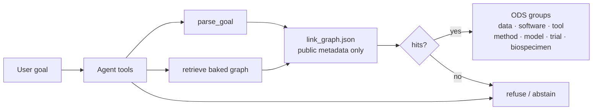
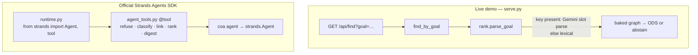

# Architecture

Cancer Output Atlas finds **already-public** cancer research outputs for a reuse goal. Find ranks a baked graph. It does not re-ingest, does not download omics, and does not invent accessions.

## Find path

User goal → parse → retrieve baked graph → ODS groups, or abstain.

## Live demo vs official Strands SDK

The live Cloud Run process is `serve.py`. It does **not** construct `strands.Agent` on each find. Official Strands lives in `runtime.py` and `agent_tools.py` (`coa agent`). The model provider is pluggable: `gemini` | `strands` | `none`. Keys are environment-only and never committed.

See the repository README for clone/run, safety rules, and how the official SDK is wired.

