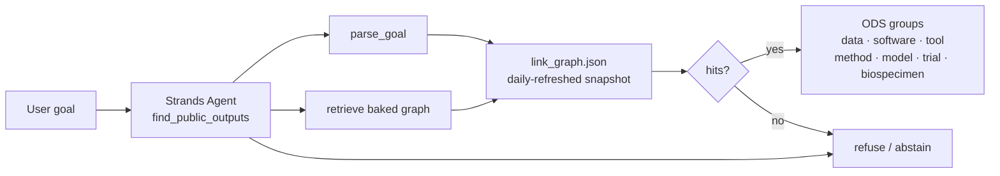
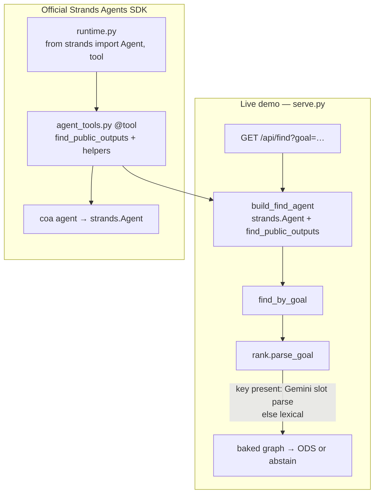

# Architecture

Cancer Output Atlas is an agent-managed living graph of public cancer research outputs, updated daily. Find ranks the current baked snapshot. Honesty rules (no invented accessions, abstain when empty, no on-click ingest, no omics download) live in the repository README [Safety](../README.md#safety) section.

## Find path

User goal → Strands agent (`find_public_outputs`) → parse → retrieve baked graph → ODS groups, or abstain.

## Live demo vs official Strands SDK

The live Cloud Run process is `serve.py`. When `strands-agents` is installed, each `GET /api/find` constructs an official `strands.Agent` via `build_find_agent` with a `find_public_outputs` tool wrapping `find_by_goal`. Official Strands also lives in `runtime.py` and `agent_tools.py` (`coa agent`). The model provider is pluggable: `gemini` | `strands` | `none`. Keys are environment-only and never committed.

See the repository README for clone/run, Safety, and how judges see Strands.
